# Godzilla企业级前端应用框架

## 1.背景

- 前端单体应用越来越复杂，慢慢变成一个巨石应用。微前端理念应运而生，微前端类似后端的微服务概念，将复杂前端应用拆成多个独立的子应用，支持独立开发、部署和升级，兼容多种技术栈，最后将子应用整合起来并且支持应用间的互相通讯。在传统前端业务开发⾯临的问题 单体应⽤体积过⼤ ：业务集中，业务分⽀众多，业务复杂度不断上⻓，包体积不断变⼤ 更新频繁⾮常⾼ ：每个业务分⽀都有⾃⼰的更新频率，发布频率的总和会⾮常⾼、⾮常频繁 上线慢且成本很⾼ ：每次分⽀升级都务必联动整个项⽬进⾏升级，测试、上线的成本巨⼤ 架构难以升级 ：项⽬越⼤，灵活性越差，架构调整的可能性越⼩ 在银行、基金、券商等金融机构工作领域有众多业务板块，系统管理、组合管理、指令管理、⽇终管理、 ⻛控管理、估值管理，有的项目单项⽬前端代码量已超几十万⾏。 每个业务分⽀有⾃⼰的需求及 bug 修复再加上⽤户需求第⼀时间响应，版本发布计划 形同虚设，紧急发版说来就来。⼀周5次紧急发版你能忍？ ⼀次紧急修复，牵⼀发⽽动全身。开发⽆法评估影响范围、测试测不完、运维通宵发 布。 项⽬太⼤，架构升级⻛险⾮常⾼，架构越来越难动，开发⼈员体验变差。 模块间存在藕合，容易导致公⽤资源、代码冲突，各模块开发⼈员难以考虑不相关模块 兼容性。 团队⼈员容易达到瓶颈，加⼊更多的⼈也⽆法有效发挥价值，管理者管不过来。 扩充⼈员⼗分困难，⾯对庞⼤的应⽤体系，难以理解，⽆法快速上⼿。

---

## 2.整体介绍

- Godzilla，中文可发音为哥斯拉，是一个高度集成的企业级 React 微前端应用框架。Godzilla 以路由为基础，支持约定式路由，并以此进行功能扩展，比如支持路由级的按需加载，支持微前端，支持嵌入子应用。 然后配以完善的工作台体系，覆盖从源码到构建产物的每个生命周期，支持各种功能扩展和业务需求，目前已有 40+（封装或者自研）组件。
- Godzilla 是底层前端框架，已直接或者间接的服务了很多前端应用。他已经很好地服务了我们的内部用户，同时希望他也能服务好外部用户。
- 面对这样的行业发展背景和特点，宽拓提出了自己的前端框架解决方案Godzilla，Godzilla 框架集成了微前端、工作台组装等前沿技术，并针对资管类业务封装了众多业务组件，帮助前端工程师快速构建项目，加速项目迭代。除此之外，前端开发人员可以利用Godzilla高效实现旧系统整合、异构技术整合，打造统一用户体验，它是一个高度集成的企业级 React 微前端应用框架。Godzilla 以路由为基础，支持约定式路由，并以此进行功能扩展，比如支持路由级的按需加载，支持微前端，支持嵌入子应用。 然后配以完善的工作台体系，覆盖从源码到构建产物的每个生命周期，支持各种功能扩展和业务需求，目前已有 40+（封装或者自研）组件。


---

## 3.特性

- [📦 **开箱即用**，使用脚手架一键生成项目，内置 react、react-router、mobx、antd 等](###4.脚手架一键生成完整项目)。
- [🏈 **路由和菜单的管理**，支持配置的路由和菜单方式](###6.路由和菜单的管理)。
- [🎉 **完善的组件体系**，覆盖了表格、表单、模态框等组件](##7.完善的组件体系)。
- [🛠 **公共的工具类库**，封装对浏览器的存储，统一的API请求方式，其他通用方法等常用工具](##8.公共的工具类库)。
- [👨🏻‍💻 **支持微前端**，多应用独立部署，统一门户，多团队独立开发，研发过程中规范的约束，降低维护成本和提升协同及代码的质量，提高开发效率](###9.支持微前端)。
- [🖥 **内置工作台**，自定义工作台布局，支持各种拖拉拽](###10.个性化工作台)。
- [✨ **个性化的主题开发**，支持自定义主题风格的切换模式](###11.主题开发)。
- [⚡️ **服务端的交互集成Yapi接口管理平台和本地Mock**，Mock定义接口的返回，支持 postman, har, swagger 数据导入，接口的自动化测试](####12.服务端的交互)。


---

## 4.脚手架一键生成完整项目

#### 4.1.设置 npm 镜像仓库

- 依赖 node10.x 及以上版本，我们默认您已经安装 node 环境，如果您本地没有安装 node 环境，请[安装](https://nodejs.org/zh-cn/)

```shell
npm login -registry=https://artifact.iquantex.com/repository/npm-local/ -scope=@gza
- Username: 【npm user】
- Password: 【npm password】
- Email: 【your email】
```

#### 4.2.全局安装 @gza/create-godzilla-app

```shell
npm i -g @gza/create-godzilla-app@latest
```

#### 4.3.使用`gza`命令创建项目

```shell
gza init godzilla-portal # 初始化UI应用，`godzilla-portal` is your project name
cd godzilla-portal
npm start
```

- 打开浏览器 [http://127.0.0.1:8888](http://127.0.0.1:8888/) 输入用户名密码（任意）即可进入系统

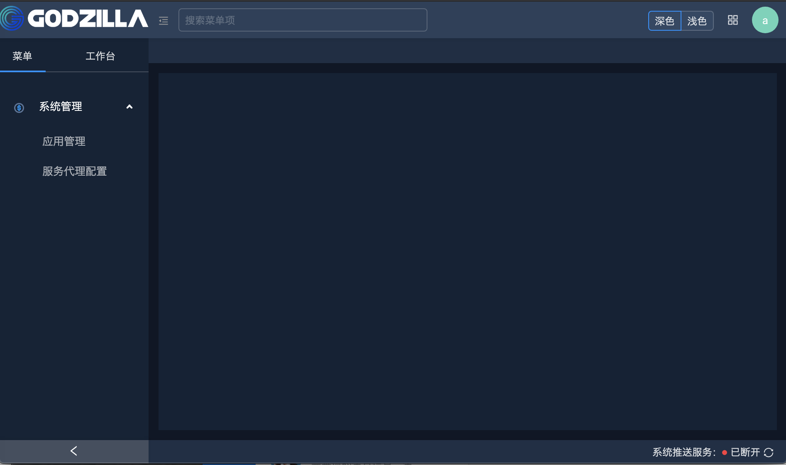

#### 4.4.项目结构

```shell
├── README.md                  项目README
├── app                        应用目录
│   ├── pages                  业务组件目录，约定该目录下编写业务组件
│   ├── layouts                layout设置
│   ├── globals.d.ts           全局ts配置文件
│   └── index.d.ts             其他ts配置文件
├── config
│   └── config.ts              项目配置文件
├── devops                     部署文件
├── dist                       打包目录
├── docker                     docker配置目录
│   ├── Dockerfile
│   └── nginx.conf
├── package-lock.json
├── package.json
├── .editorconfig              编辑器设置
├── .eslintignore              eslint ignore
├── .eslintrc.js               eslint 配置文件。已按开发规范生成了对应的详细配置，无需再进行手动配置，跨项目统一。
├── .gitignore                 git ignore
├── .npmignore                 npm ignore
├── .prettierrc.js             代码自动格式化配置文件。已按开发规范生成了对应的详细配置，无需再进行手动配置，跨项目统一。
├── .stylelintrc.js            css、less、scss样式格式化配置。已按开发规范生成了对应的详细配置，无需再进行手动配置，跨项目统一。
├── tests                      测试目录
└── tsconfig.json              TypeScript 配置文件
```

- 约定在app/pages应用目录下编写页面，约定式路由会在pages目录下找到对应的组件页面。
- 约定在app/layouts/index.ts 文件下，配置本地开发环境的菜单和路由。

```javascript
import defaultLayouts from '@/containers/defaultLayouts';
import { cloneDeep } from 'lodash';
const layouts = cloneDeep(defaultLayouts);
// 配置菜单
layouts.main.getUserMenu = () => {
  return Promise.resolve({
    code: 200,
    data: {
      list: [
        // 一级菜单
        {
          id: 100,  // 子菜单 ID，设置为一级菜单时与一级菜单ID一致
          pId: 100, // 一级菜单 ID
          icon: 'chanpinguanli',
          appId: 'portal', // 应用ID，与 UI 应用 config / config.ts 属性 APP_ID 的值一致
          name: '系统管理', // 菜单名称
        },
        // 子菜单
        {
          id: 101,
          pId: 100,
          appId: 'portal',
          name: 'Application',
          url: 'portal/system/Application',
        },
        // 子菜单
        {
          id: 102,
          pId: 100,
          appId: 'portal',
          name: 'Menu',
          url: 'portal/system/Menu',
      ],
    },
    msg: '操作成功！',
  });
};
export default layouts;
```

- 项目配置文件config/config.ts 是约定了项目的启动端口号，请求API的地址，本地mock地址或Yapi的服务，编译路径的别名，个性化主题的配置，以及一些功能插件的配置。

```javascript
import {IConfig} from '@/types';
// 注意！！修改该配置文件不会热更新，需要重新执行npm start
const npmScope = '@gza'; // 私有npm依赖的scope
const isDev = process.env.NODE_ENV === 'development';

const config: IConfig = {
  systemConfig: {
    devServerPort: 8888, // dev server 端口
    isPortal: true,
    npmScope: npmScope,
    godzillaLicenseKey: 'quantex__2020_4_6_[TRIAL]_MTU4NjE4NTk0NTk5MQ==9053b0c05f8a201c1275e62579d7326f',
    agGridLicenseKey: 'China_Merchants_Bank__multi_1_Devs__7_November_2020_[v2]_MTYwNDcwNzIwMDAwMA==fe663629062117b3018166f309ca7e9a',
  },
  apiConfig: {
    isDebug: true,
    // 本地mock地址
    base: isDev ? 'http://127.0.0.1:8888' : '',
    domain: {},
  },
  yapiConfig:{
    // 启动使用
    enable: false,
    // yapi网站路径，如：https://yapi.iquantex.com，可以是内部部署的链接地址
    host: 'https://yapi.iquantex.com',
    // 需要 mock 的项目 token
    token: 'e242af77e127a96f8b8eaa0fd92f276b0f2931cd9a73c60d438a1f79378f7ab3',
    // 启动自动更新接口功能
    autoUpdate: true,
    // 间隔时间，默认五分钟
    interval: 5 * 60 * 1000,
  },
  definePlugin: {
    ENABLE_SSO: false, // 是否只允许sso登录
    APP_ID: JSON.stringify('portal'), // 应用ID
    PROJECT_NAME: JSON.stringify('Godzilla 门户'), // 应用名称
  },
  webpackConfig: {
    // 引入文件路径的别名
    resolveAlias: {
      'quantex-utils': `${npmScope}/quantex-utils`,
      'quantex-design': `${npmScope}/quantex-design`,
      'quantex-scripts': `${npmScope}/quantex-scripts`,
      'quantex-scaffold': `${npmScope}/quantex-scaffold`,
    },
  },
  // 个性化主题的配置
  themeConfig: {
    // 默认是深色主题
    defaultTheme: 'themeDark',
    mainTheme: 'themeDark',
    themes: [
      {
        name: '深色',
        id: 'themeDark',
        path: '@gza/quantex-plugin-theme-dark',
        chartConfig: '@gza/quantex-plugin-theme-dark/chart.js',
      },
      // 自定义主题配置
      {
        name: 'CICC主题',
        id: 'themeCiccWhite',
        path: '@gza/quantex-plugin-theme-cicc-white',
        chartConfig: '@gza/quantex-plugin-theme-cic'
      }
    ],
  },
  pluginConfig: [
    [
      'theme-dark',
      {
        package: '@gza/quantex-plugin-theme-dark',
      },
    ],
    [
      'theme-cic',
      {
        package: '@gza/quantex-plugin-theme-cicc-white',
      },
    ],
    // 自定义功能插件配置
    // 埋点上报插件,要配合后端服务接收埋点数据并进行分析
    [
      'metrics',
      {
        enable: true, // 是否启用
        domain: 'http://10.16.18.166:32143', // 上报服务地址
        url: '/api/v1/metrics', // 上报url
        method: 'POST', // http method
        env: 'DEV', // ST、UAT、PRD等
        reportInterval: 10 * 1000, // 一分钟上报一次
        package: '@gza/quantex-plugin-metrics'
      }
    ],
  ],
};
module.exports = config;
```

---

## 5.Godzilla架构图

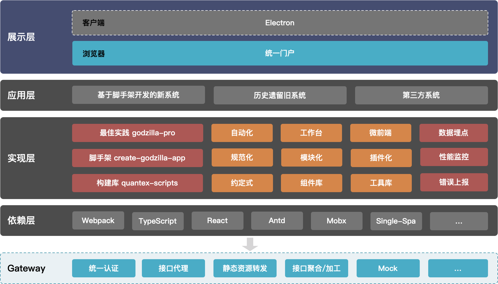

#### 	5.1前端中台应用布局图

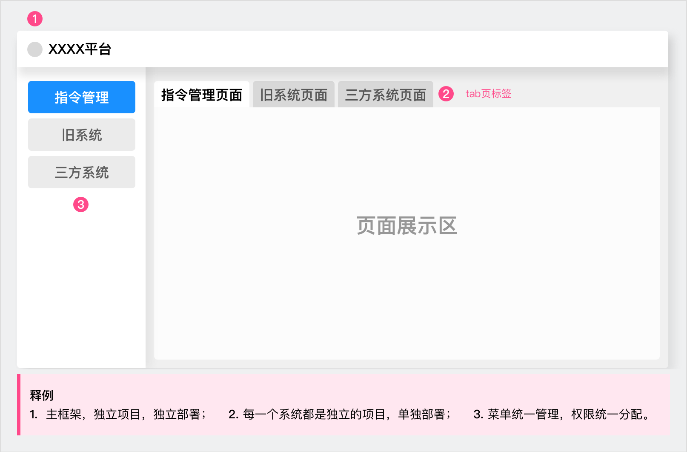

---

## 6.路由和菜单的管理

#### 6.1.概述

路由和菜单是组织起一个应用的关键骨架，Godzilla UI 中的路由为了方便管理，使用约定大于配置的方式，脚手架会自动根据 `app/pages` 下的目录和文件自动生成路由配置，应用开发无需关心具体细节。

在多应用的开发过程中，菜单路由的配置分为本地开的json配置和生产环境中的数据库配置。

#### 6.2.本地开发环境中的json配置

```javascript
layouts.main.getUserMenu = () => {
  return Promise.resolve({
    code: 200,
    data: {
      list: [
        // 一级菜单
        {
          "id": 1,              // 子菜单 ID，设置为一级菜单时与一级菜单ID一致
          "pId": 1,             // 一级菜单 ID
          "name": "一级菜单",   // 菜单名称
          "icon": "icon",
          "appId": "appId",     // 应用ID，与 UI 应用 config / config.ts 属性 APP_ID 的值一致
        },
        // 子菜单
        {
          "id": 2,              // 子菜单 ID
          "pId": 1,             // 一级菜单 ID
          "name": "子菜单",     // 菜单名称
          "appId": "appId",     // 应用ID，与 UI 应用 config / config.ts 属性 APP_ID 的值一致
          "url": "system/ServiceProxy"
        }
      ],
    },
    msg: '操作成功！',
  });
};
```

#### 6.3.生产环境中配置菜单路由

- 在生产环境中，通过管理平台来配置项目的菜单和路由，以及不同用户对菜单的权限配置。
- 示例，添加一级菜单。

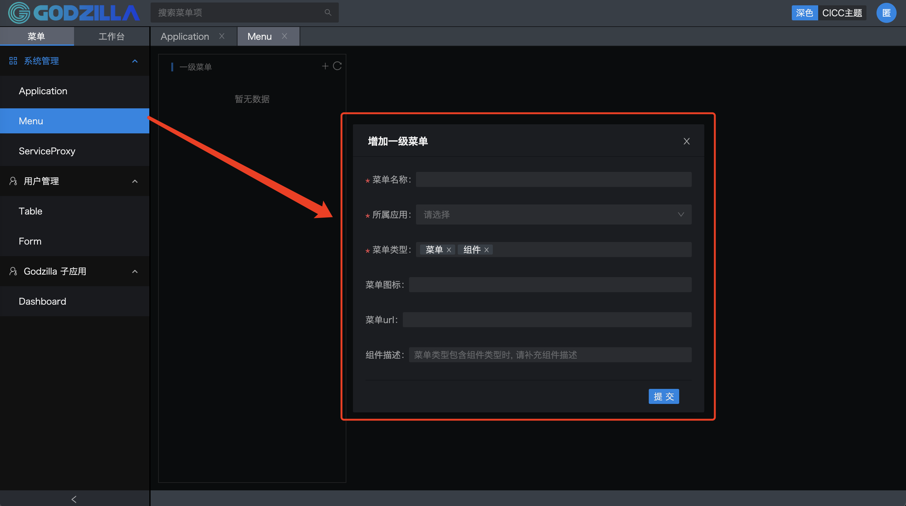

- 设置菜单的属性和关联路由地址


---

## 7.完善的组件体系

#### 7.1.概述

Godzilla 内置了一套基于ant-design的二次开发的组件库，提供了丰富的基础组件和业务组件来满足日常开发。

#### 7.2.基础组件库

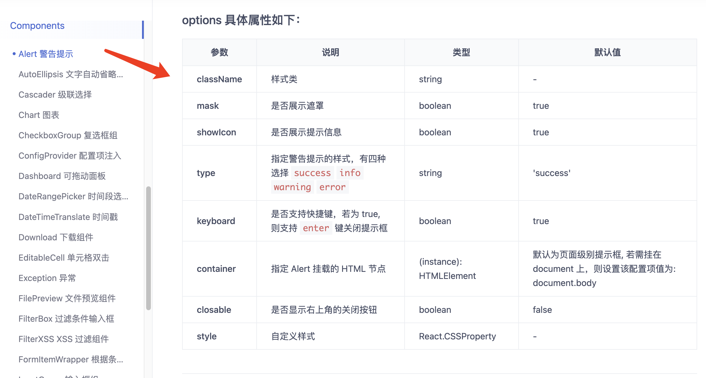

#### 7.3.业务组件库

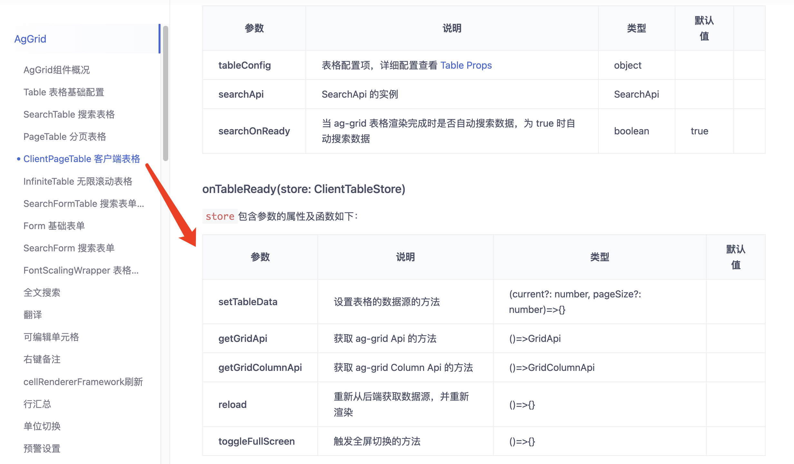

#### 7.4.二次封装的table组件示例


#### 7.5.丰富的组件库应用于复杂场景业务

- 在资管领域，有很多复杂的业务，这些业务复杂度主要体现在复杂的流程管理，比如一条指令，从指令创建、到指令审批、到指令执行，中间要经过很多环节，而且也有很多的业务方参与，完成这么一套复杂的流程，对整个系统的架构提出了更高的要求。Godzilla采用组件化的思想，并提炼了很多针对复杂场景的业务组件，组件可自由组合与拼接，帮助开发人员降低复杂度。


---

## 8.公共的工具类库

#### 8.1.概述

工具类库是基于一些通用常用的方法的封装📦，实现对业务组件需求的直接开箱即用，提升开发效率和代码的低耦合。

#### 8.2.工具库的方法

- API：是和后端交互是非常常见的，Godzilla UI 封装网络请求的 API，所有 ajax 都需要通过 `API` 这个类来发起调用，api 的风格采用 restful api。
- DBUtil：是一个自动识别运行环境并选取合适存储方式, 并对外提供一致 api 的存储工具库。

  - 浏览器环境: 使用 IndexedDB 存储
  - Electron 环境: 使用文件存储
  - 提供 Adaptor：自定义存储方式（例如存储到后台数据库）
- DoubleUtil：当涉及到金额类的四则运算时，为了防止精度丢失，提供专门的工具函数，更专业，更有保障。
- MsgCenter：采用发布 / 订阅模式设计，主要使用场景： 跨组件通信（不建议在工作台中使用，[工作台开发](###10.个性化工作台)自带专用的通信）
- Store：底层使用 LocalStorage，支持按用户存储
- 使用装饰器：

  1. @response()

     - 使用 @response 时包裹请求时，业务代码不需要处理成功失败的弹窗处理，其余逻辑不影响。

     - 被包裹的方法必须返回的是 promise 对象才可使用此装饰器。

  2. @norepeat()

     - 避免重复提交，被包裹的方法必须返回的是 promise 对象才可使用此装饰器

  3. @retry()

     - 使用装饰器 @retry()，当调用成功时，会返回 res 对象
     - 当调用超时(状态码 408)，将弹窗显示`重试`及`稍后处理`
     - 被包裹的方法必须返回的是 promise 对象才可使用此装饰器
- 工具库的API使用的示例源码（API类工具🔧）
  - 封装后的方法导入既用，开发代码量少，逻辑清晰易懂。


```javascript
// 📦封装的工具类方法导入
import { API, decorators } from '@gza/quantex-utils';

const { response } = decorators;
class Store {
  // 直接实例，调取api 下的请求方法
  api = new API('auth');

  // 在TS模式下，装饰器不支持箭头函数
  @response('新增成功')
  addServiceProxy(params: object) {
    return this.api.post('/api/v1/service_proxies', params);
  }

  @response('修改成功')
  updateServiceProxy(params: object) {
    return this.api.put('/api/v1/service_proxies/{id}', params);
  }

  @response('删除成功')
  deleteServiceProxy(params: object) {
    return this.api.delete('/api/v1/service_proxies/{id}', params);
  }
}
export default Store;
```

---

## 9.支持微前端

#### 9.1.概述

Godzilla  是一个面向大型系统的微前端解决方案，适用于以下业务场景：

- 后台比较分散，体验差别大，因为要频繁跳转导致操作效率低，希望能统一收口的一个系统内
- 单页面应用非常庞大，多人协作成本高，开发/构建时间长，依赖升级回归成本高
- 系统有二方/三方接入的需求

Godzilla 在保证一个系统的操作体验基础上，实现各个子应用的独立开发和发版，框架应用通过 Lego 管理子应用的注册和渲染，将整个系统彻底解耦。

#### 9.2.架构设计


- 按照 UI 结构进行框架应用、子应用的拆分
- 框架应用：负责子应用的注册，公共内容展示（Common Header、Common Menu、Common Footer等）
- 子应用：负责自身业务相关的内容展示

#### 9.3.异构系统整合

- 在金融领域公司，有很多存量系统，一体化的需求越来越强烈，如果去改造这些系统，成本会很高，而且风险也很大，Godzilla支持将存量系统整合到一个平台上来，而且改造工作量很小，风险也很低，但却能提供很好的一体化体验。


#### 9.4.多团队独立开发

- 在中后台领域，系统都会比较复杂，有可能一个系统要分为几条产品线和业务线，开发成员小则十几号人，多则上百号人，团队越大，管理的成本越高，Godzilla支持微前端架构，可以将一个复杂系统拆分成一个一个子系统，每个子系统各负责一个模块，从而可以将大的开发团队拆分成一个一个的小团队，各负责一个产品线或业务线，既能降低管理的成本，又能提高开发效率，加速项目迭代。


#### 9.5.微应用的接入管理

- 新增应用的配置，在打开[应用管理]菜单，配置选项。


- 其次，需要配置一个菜单，打开 layouts 并新增一个菜单（目前都是静态菜单，将来改为动态菜单时可通过界面配置），参考[路由和菜单](###6.路由和菜单的管理)，菜单信息如下:

```javascript
// src/app/layouts/index.ts
  {
    "id": 30, // 新增一级菜单（子应用）
    "pId": 30,
    "icon": "chanpinguanli", // 菜单图标
    "appId": "portal", // 统一为 portal
    "name": "子应用"
  },
  {
    "id": 31, // 菜单ID，需要唯一
    "pId": 30, // 父级菜单ID
    "name": "百度", // 菜单名称
    "appId": "baidu", // 应用
    "url": "" // 由于这个子应用只有一个菜单，所以不需要配置菜单URL，菜单URL已经在应用接入那里配置了
  },
```

- 最后，并刷新页面，可以看到新增了一个一级菜单[子应用]和对应的二级菜单[百度]


注意，需要通过 127.0.0.1 访问，而不能通过 localhost 访问，否则可能出现页面访问不了的情况

#### 9.6.子应用单独的工程

- 新建的子应用，能独立开发和部署。
- 在修改 config/config.js 配置文件，将 APP_ID 由`portal`改为`godzillaPro`，将 isPortal 设置为`false`（或者删除这个配置项），将 devServerPort 设置为`8889`(或者其它端口)
- 加子应用的测试菜单，同样在 layouts 增加静态菜单，这里需要注意 appId 必须为 godzillaPro（也即子应用的 ID），以下为示例菜单，按照这种数据结构可增加其它菜单

```javascript
({
  "id": 38,
  "pId": 30,
  "name": "godzillaPro-用户管理",
  "appId": "godzillaPro",
  "url": "sample/table/User"
},
{
  "id": 39,
  "pId": 30,
  "name": "godzillaPro-应用接入",
  "appId": "godzillaPro",
  "url": "system/Application"
})
```

- 最后，启动 godzilla-pro，访问[http://127.0.0.1:8889](http://127.0.0.1:8889) 这个子应用就跑起来了，这个子应用可独立开发和部署


#### 9.7.多个子应用接入portal平台(主应用)

- 统一访问入口
- 多应用管理


#### 9.8.微前端的特性

- 子应用支持 React框架(其它框架通过iframe接入)
- 框架应用只需依赖 npm 包 @gza/quantex-scaffold，不耦合任何工程体系
- 子应用独立开发、不耦合任何工程体系，已有应用迁移成本极低
- 整个系统用户体验好，跟 SPA 应用基本一致
- 子应用只需发布前端资源 bundle 即可，框架应用通过 bundle 渲染子应用

------

## 10.个性化工作台

#### 10.1概述

- 工作台分为个人工作台和系统工作台（系统场景），个人工作台顾名思义就是用户自己定义的工作台，系统工作台就是由运维人员事先定义好的工作台，其它人可以直接使用（授权后可使用）。

- 工作台相当于一个容器，容器包含很多面板，每一个面板可以承载一个或多个组件，面板可以随意缩放大小，面板与面板之前可以相互联动。工作台或者面板只是提供一个壳，这个是框架已经支持了，但是里面的组件是需要开发。

- 工作台中的组件可以来自于不同的子应用，或页面组件。

#### 10.2.新增工作台布局

- 新增工作台可选择不同布局和系统场景。
- 可配置工作台名称和默认工作台等属性。


- 新建的TSP工作台的页面布局


#### 10.3.在工作台中添加组件库

- 添加的组件库可以是 pages 页面或子应用。

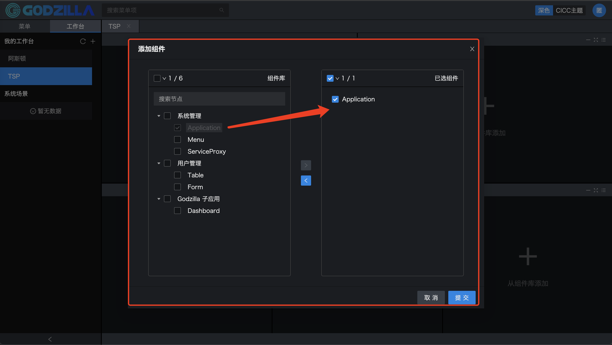

- 成功添加工作台组件


#### 10.4.完整的工作台组件页面示例


#### 10.5.工作台组件的参数存储模式图

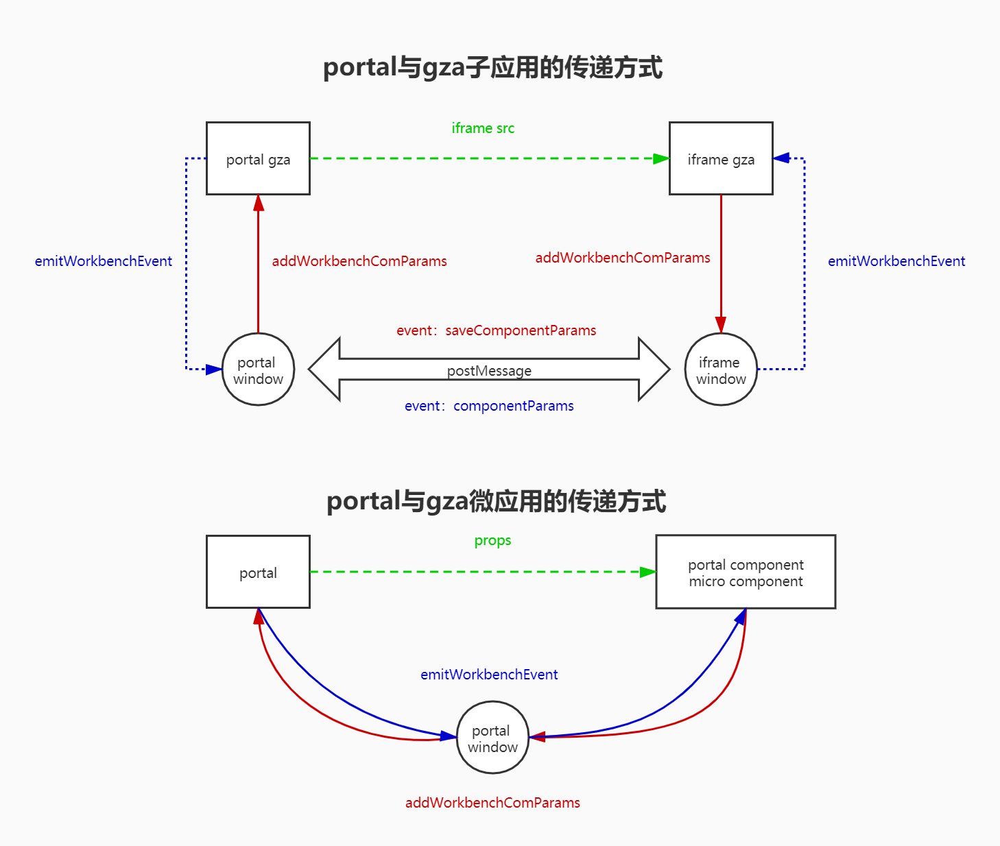

#### 10.6.工作台组件间通信模式图


- 工作台子应用之间的通信技术示例代码：

  1. 发送事件：示例：子系统 A 发送【改变用户权限】事件

  ```javascript
  sendWorkbenchEvent = props => {
    window.isInWorkbench &&
      window.parent.postMessage(
        {
          // 类型，标识为工作台事件，写死
          type: 'workbenchEvent', // 类型，标识为工作台事件
          // 目标应用Id，向那个应用发送事件，如果不指定，则向所有iframe发送事件
          appId: 'godzillaPro2',
          // 工作台Id，这个参数会在加载iframe的时候，通过url传给子系统
          // 指定事件只会向所在的工作台中的其它iframe发送，如果不指定，则向所有iframe发送
          // window._workbenchId,这个变量就是从url获取到，然后存储在window对象
          workbenchId: window._workbenchId,
          // 面板Id，，这个参数会在加载iframe的时候，通过url传给子系统
          // 指定事件不会向自身应用发送，也即自身即使监听了该事件，也不会收到事件
          // window._layoutItemId,这个变量就是从url获取到，然后存储在window对象
          layoutItemId: window._layoutItemId,
          // 事件名称，可以随意指定，但要确保唯一，事件要有含义
          eventName: 'userRole-data-changed',
          // 携带的业务数据,对象存储
          props: {
            type: 'addUser',
            data: {} // user数据
          } // 携带的业务数据
        },
        '*'
      );
  };
  ```

  2. 接收事件：示例：子系统 B 响应【改变用户权限】事件

  ```javascript
  window.addEventListener(
    'message',
    event => {
      const { type, eventName, props } = event.data;
      if (type === 'workbenchEvent') {
        // 发送事件和接收事件的名称要一致
        if (eventName === 'userRole-data-changed') {
          // 响应事件逻辑
          console.log(data);
        }
      }
    },
    true
  )
  ```

---

## 11.主题开发

#### 11.1概述

Godzilla 基于 Ant Design 视觉风格搭建了 Godzilla Design，这套风格经过设计师的精心调配，适合大多数中后台项目。如果对视觉风格有额外的要求，推荐使用以下的方式进行定制。

#### 11.2默认深色主题

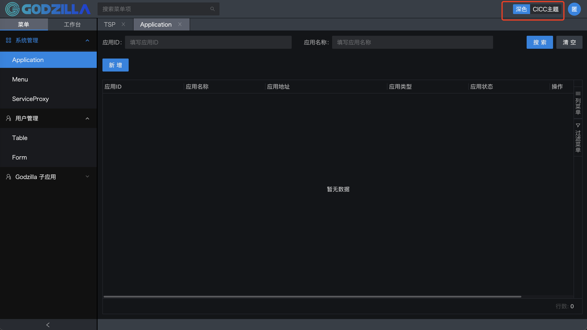

#### 11.3.自定义红色主题

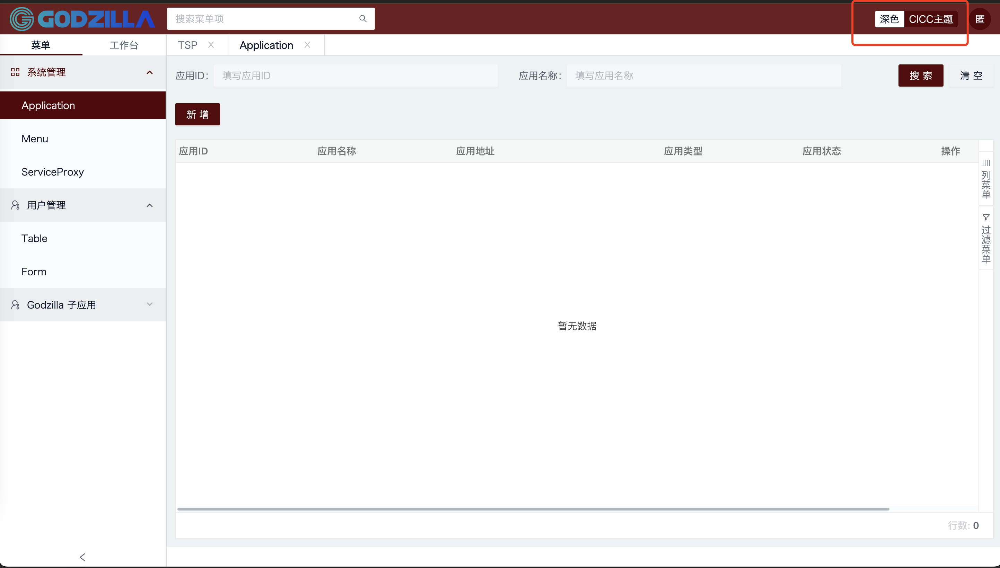

#### 11.4.可自定义主题配置

```javascript
// 在quantex-scaffold项目的配置文件config/config.ts中
  themeConfig: {
    // 指定默认主题: 对应themes中的id
    defaultTheme: 'themeDark',
    mainTheme: 'themeDark',
    // 主题配置
    themes: [
      // 默认主题
      {
        // 名称
        name: '深色',
        // id
        id: 'themeDark',
        // 主题文件路径
        path: path.join(__dirname, '../packages/quantex-plugin-theme-dark'),
        // chart主题配置文件
        chartConfig: darkChart,
      },
      // 添加自定义主题的配置
      {
        name: '红褐色',
        id: 'themeWhiteCCC',
        path: path.join(__dirname, '../packages/quantex-plugin-theme-cicc-white'),
        chartConfig: whiteChart,
      },
    ],
  },
```

#### 11.5.实现背景

- 基于 Avatar 组件规范 V2.0 和 quantex-desgin 的设计规范体系进行组建主题开发。

  [Quantex Design_设计规范体系](Quantex Design_设计规范体系.pdf)

  1. quantex-design 是基于 ant-design 的二次封装；
  2. ant-design 使用的是 less 方式 处理 css;
  3. quantex-scaffold 使用的是 sass 方式处理 css;
  4. quantex-scaffold 同时会依赖 ant-design css;
  5. css variables 一定程度上吸收了 less/sass 处理 css 的方式，且主流浏览器都已支持；
  6. 因此在点击主题切换按钮时，quantex-design 和 ant-design 所有的组件样式都需要进行切换。
  7. 为减少代码量，同时可以复用部分代码。决定使用 css variables + 样式覆盖的方案进行主题切换的实现。
  8. 样式覆盖：需要针对所有组件的所有样式进行覆盖。
  9. css variables: 样式覆盖使用的样式需要使用 css variables 进行定义。
  10. 因此在 build 完成之后，会生成组件 css 文件 + css variables 文件；主题切换加载不同 css variables 文件即可。

#### 11.6.自定义主题开发原理

1. 使用 css variales 对组件样式进行覆盖；
2. build 生成组件样式文件和 css variables 文件；
3. 组件样式使用的 css 变量都定义在统一的 css variables 文件中；
4. 切换主题即加载不同 css variables 文件；
5. 同时自定义主题只需要根据现有 css variables 文件进行修改；

---

## 12.服务端的交互

#### 12.1.概述

Godzilla UI 是一套基于 React、Ant Design、Mobx 技术栈的单页面应用，我们提供的是前端代码和本地模拟数据的开发模式，通过 API 的形式和任何技术栈的服务端应用一起工作。在 Godzilla UI 中，一个完整的前端 UI 交互到服务端处理流程是这样的：

- UI 组件交互操作；
- 调用 Store.js 的处理函数（每个组件有独立的 store）；
- 使用封装的 API 发送请求；
- 获取服务端返回；
- 然后调用 action 函数改变 mobx 对象；
- 页面自动重新 render。

从上面的流程可以看出，为了方便管理维护，统一的请求处理都放在 `Store.js` 这个文件中，一个页面组件的所有与后端的交互都放在这里统一管理。

其中，`quantex-utils/API` 是基于 [fetch](https://developer.mozilla.org/en-US/docs/Web/API/Fetch_API/Using_Fetch) 的封装，便于统一处理 POST，GET、DELETE、PUT 等请求参数，请求头，以及错误提示信息等。

**封装的 API 类库，即开箱使用，编写简单，代码低耦合，使用方便**。

例如在 Store 中的一个请求用户信息的例子：

```javascript
// Store.js
import { observable, action } from 'mobx';
import { API } from '@gza/quantex-utils';
class Store {
  api;
  constructor() {
    this.api = new API('auth');
  }
  // 获取登录用户信息
  getUserInfos = () => {
    return this.api.get('/api/v2/user_infos/current_user');
  };
}
export default Store;
// 在组件中使用接口调取
// index.js
import React, { Component } from 'react';
import { observer } from 'mobx-react';
import { Alert } from '@gza/quantex-design';
import Store from './Store';
@observer
class LoginContainerComponent extends Component {
  store = new Store();
  componentDidMount() {
    this.store.getUserInfos().then(res => {
      if (res.code == 200) {
        // 处理业务逻辑
      } else {
        // 错误弹出框
        Alert.error(res.msg);
      }
    });
  }
  render() {
    return (
      <div></div>
    );
  }
}
export default LoginContainerComponent;
```

Mock 数据是前端开发过程中必不可少的一环，是分离前后端开发的关键链路。通过预先跟服务器端约定好的接口，模拟请求数据甚至逻辑，能够让前端开发独立自主，不会被服务端的开发所阻塞。Godzilla 框架内置了两种Mock数据的方式：

1. UI 端本地Mock数据。（通过约定在pages文件夹下的__mock.(js|ts)_文件来实现）
2. yapi（后端开发人员在yapi平台定义api，前端在config中配置即可对yapi中部署的mock api进行联调）

#### 12.2.UI 端本地Mock数据

- Godzilla 框架约定 pages 文件夹下的 _mock. ( ts | js ) 文件即 mock 文件，文件导出接口定义，支持基于 require 动态分析的实时刷新，支持 TS 语法，以及友好的出错提示，基于[mocker-api](https://github.com/jaywcjlove/mocker-api)封装

```javascript
// **/_mock.js 或者 **/_mock.ts
module.exports = {
  'GET /api/users/list': { code: 200, data: { list: [1, 2] }, msg: '' },
  'GET /api/users/1': { code: 200, data: { id: 1 }, msg: '' },
  // 支持自定义函数，API 参考 mocker-api
  'POST /api/users/create': (req, res) => {
    res.end('OK');
  }
};
```

#### 12.3.Yapi的接口管理和数据转发

- YApi 是**高效**、**易用**、**功能强大**的 api 管理平台，旨在为开发、产品、测试人员提供更优雅的接口管理服务。可以帮助开发者轻松创建、发布、维护 API，YApi 还为用户提供了优秀的交互体验，开发人员只需利用平台提供的接口数据写入工具以及简单的点击操作就可以实现接口的管理。

- Godzilla 框架约定在config/config.ts的配置文件中对Yapi的配置。

  ```javascript
  import {IConfig} from '@/types';
  const isDev = process.env.NODE_ENV === 'development';
  const config: IConfig = {
    yapiConfig:{
      // 启动使用
      enable: true,
      // yapi网站路径，如：https://yapi.iquantex.com
      host: isDev ? 'https://yapi.iquantex.com' : '',
      // 需要 mock 的项目 token
      token: 'e242af77e127a96f8b8eaa0fd92f276b0f2931cd9a73c60d438a1f79378f7ab3',
      // 启动自动更新接口功能
      autoUpdate: true,
      // 间隔时间，默认五分钟
      interval: 5 * 60 * 1000,
    }
  };
  module.exports = config;
  ```

#### 12.4.Yapi平台的接口管理

- Yapi平台的接口管理

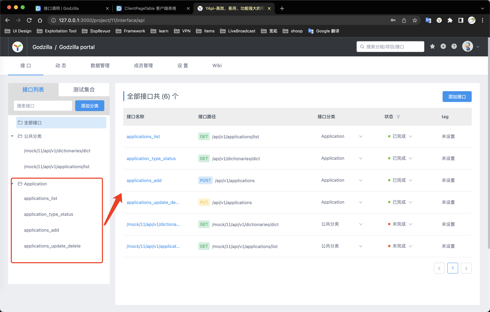

- 可期望Mock断言返回数据格式

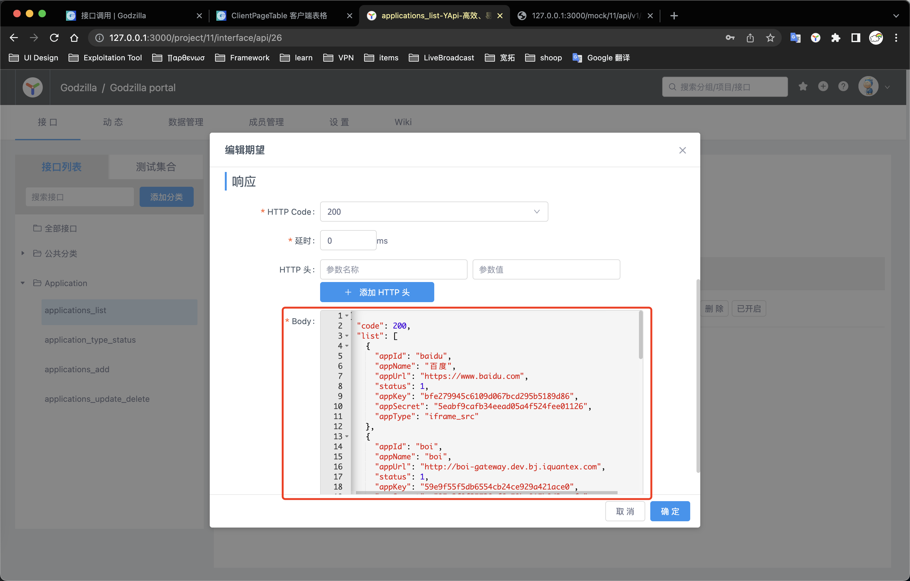

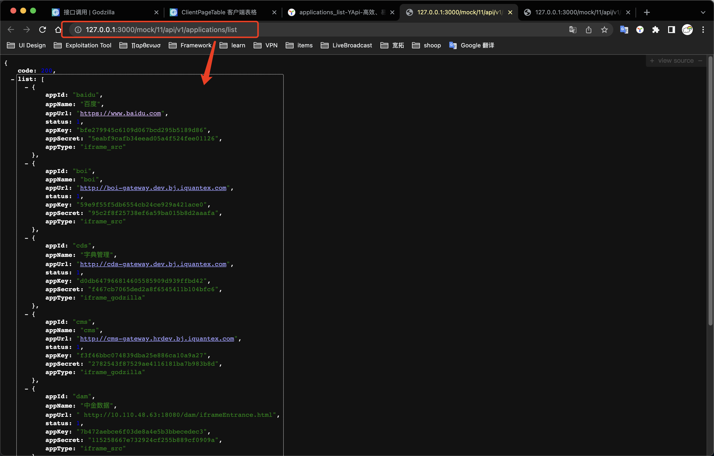

- Yapi可以对接口的测试及断言

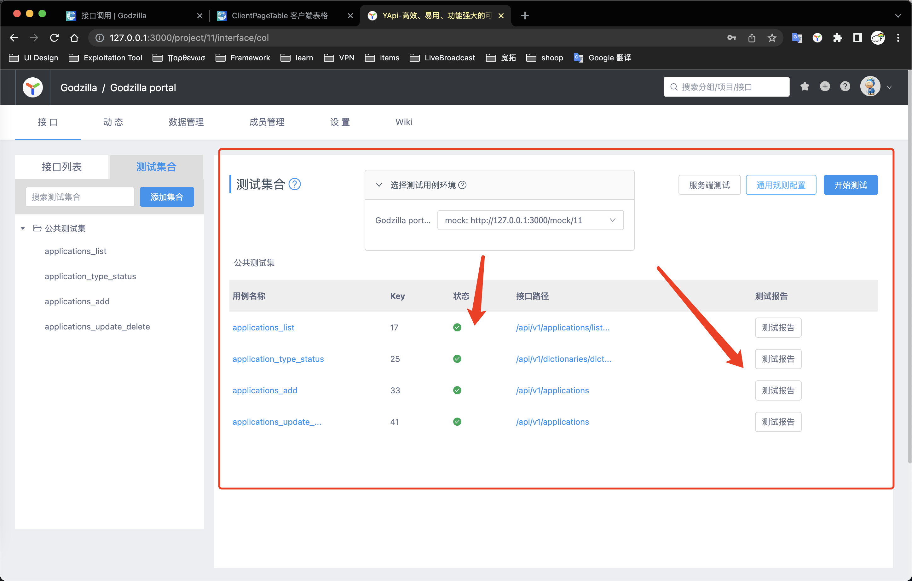

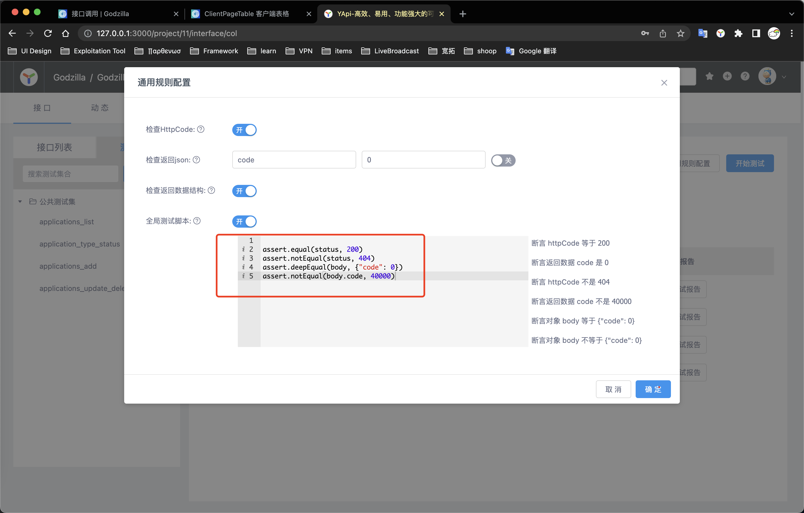

- 多人协同开发

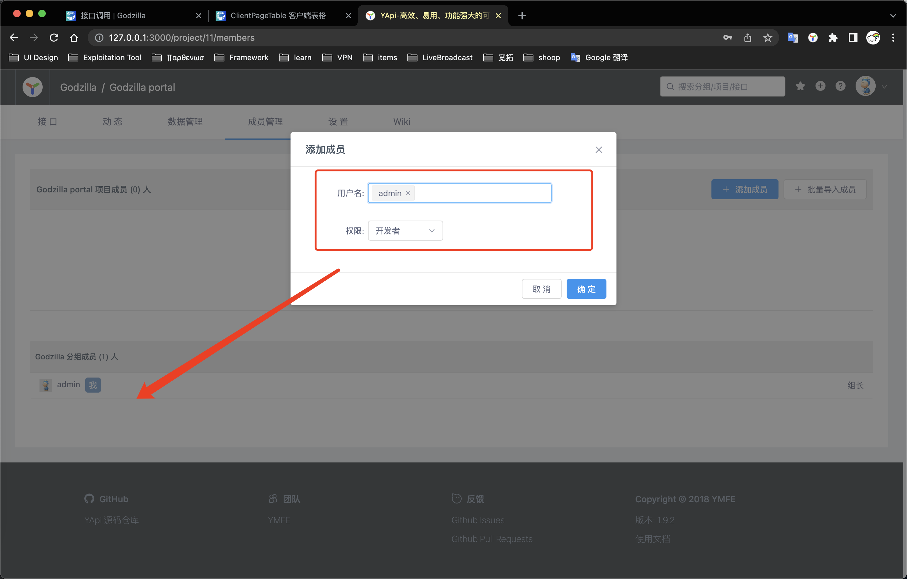

- Yapi平台的特性

  1. 基于 Json5 和 Mockjs 定义接口返回数据的结构和文档，效率提升多倍

  2. 扁平化权限设计，即保证了大型企业级项目的管理，又保证了易用性

  3. 类似 postman 的接口调试
  4. 自动化测试, 支持对 Response 断言
  5. MockServer 除支持普通的随机 mock 外，还增加了 Mock 期望功能，根据设置的请求过滤规则，返回期望数据
  6. 支持 postman, har, swagger 数据导入
  7. 免费开源，内网部署，信息再也不怕泄露

---

## 13.项目打包

#### 13.1.概述

项目的运行和编译环境的是基于webpack构建工具的二次开发的 quantex-scripts 完成的。

quantex-scripts 有一整套的机制去更好的处理项目中的文件压缩，文件路径别名，项目开发过程中的热更新等，更好的提升开发效率。

在执行打包命令成功之后，会在根目录生成 dist 文件夹，里面就是构建打包好的文件，通常是 *.js、*.css、index.html 等静态文件,然后就可以将这些静态资源文件拷贝到 CDN、nginx 等静态资源服务器部署应用。

#### 13.2.quantex-scripts 所有命令

```shell
npm start
# 执行页面入口检查，遍历 app/containers/page 下所有 index.jsx or index.tsx 文件，生成的页面路径保存在 app/containers/page/page.json 文件中
# 执行 npm run dev

npm run dev
# 执行 quantex-scripts start
# 读取 quantex 的 dev 配置文件
# 启动开发环境下的 webpack 编译

npm run dist (dist:base | dist:pre | dist:prod)
# production(生产)下打包，打包 app 到 dist 目录下，入口文件 app/index.js

npm run analyze
# 分析打包后的 bundle size 以及 包含 的 chunk 模块
# 打包后会开启一个本地 10086 端口，localhost:10086 可访问页面查看

npm run dll
# 预编译第三方库，打包后会生成 manifest.json 和 lib.js 到 build 目录

npm run dll:prod
# 预编译下将会执行 uglify 操作

npm run lint
# 检查 js 代码风格

npm run lint:fix
# 检查 js 文件风格并执行修正

npm run postdist:pre (pre 环境)
# npm run install-build-dependencies —> 安装 dist 包下 electron 依赖
# 拷贝 app/_config/pre/api.js 到 dist/assets/js 下

npm run postdist:prod (prod 环境)
# npm run install-build-dependencies` —> 安装 dist 包下 electron 依赖
# 拷贝 app/_config/prod/api.js 到 dist/assets/js 下

npm run start-components-debug
# 启动 quantex-design 在开发环境下的调试模式 quantex-scripts 会修改 alias 配置，把 quantex-design 的引用指向 design 目录

npm run build-comp-ids
# 针对每个 index.jsx 入口生成唯一 TableId，并保存在 app/common/compIds.json 中

npm run build-page-path
# npm start 时自动执行，自动生成页面入口路径 json, 保存在 app/container/page/path.json 下
```